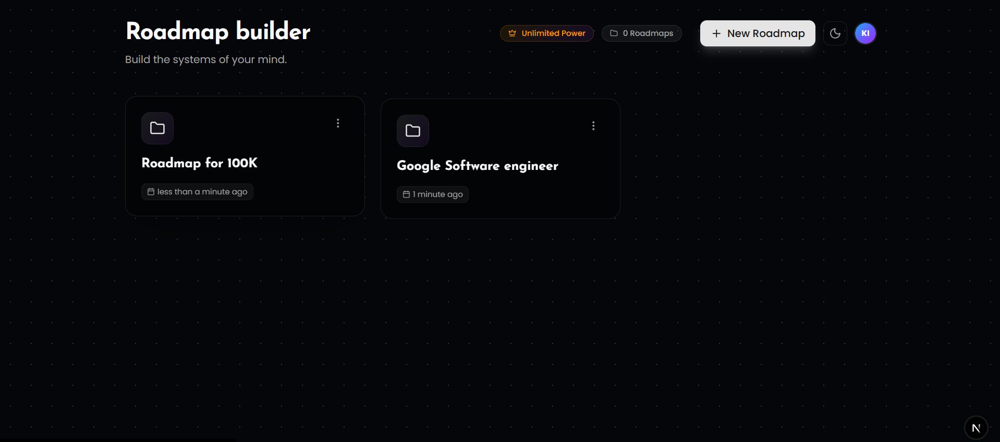

# Roadmap Builder

A powerful, AI-assisted roadmap generation tool built with **Next.js 16**, **React 19**, and **Supabase**. Visualize your learning paths and project plans with an interactive, infinite canvas.



## 🚀 Features

### 🤖 AI-Powered Generation
Generate comprehensive roadmaps from simple text descriptions using **Google Gemini AI**.


### 🎨 Interactive Infinite Canvas
Explore and organize topics with a "Spine and Rib" layout on a zoomable, pannable canvas powered by **React Flow**.


### ✨ Node Enhancement & AI Chat
Expand your knowledge with AI-driven node expansion, detailed notes, and context-aware chat.


### 🌓 Dark & Light Mode
Fully responsive design with seamless dark and light mode support locally and across the app.


## 🛠️ Tech Stack

-   **Framework**: [Next.js 16](https://nextjs.org/) (App Router)
-   **Library**: [React 19](https://react.dev/)
-   **Styling**: [Tailwind CSS 4](https://tailwindcss.com/)
-   **Database & Auth**: [Supabase](https://supabase.com/)
-   **Canvas Engine**: [React Flow 12](https://reactflow.dev/)
-   **AI Model**: [Google Gemini](https://ai.google.dev/)
-   **Icons**: [Lucide React](https://lucide.dev/)
-   **State Management**: [Zustand](https://github.com/pmndrs/zustand)
-   **Animations**: [Framer Motion](https://www.framer.com/motion/)

## 📦 Getting Started

### Prerequisites

-   Node.js 20+
-   npm, yarn, or pnpm

### Installation

1.  **Clone the repository**:
    ```bash
    git clone <repository-url>
    cd roadmap-builder
    ```

2.  **Install dependencies**:
    ```bash
    npm install
    ```

3.  **Environment Setup**:
    Create a `.env.local` file in the root directory and add the following keys:

    ```env
    NEXT_PUBLIC_SUPABASE_URL=your_supabase_url
    NEXT_PUBLIC_SUPABASE_ANON_KEY=your_supabase_anon_key
    GEMINI_API_KEY=your_gemini_api_key
    ```

4.  **Run the development server**:
    ```bash
    npm run dev
    ```

    Open [http://localhost:3000](http://localhost:3000) with your browser to see the result.

## 🤝 Contributing

Contributions are welcome! Please feel free to submit a Pull Request.

## 📄 License

This project is licensed under the MIT License.
